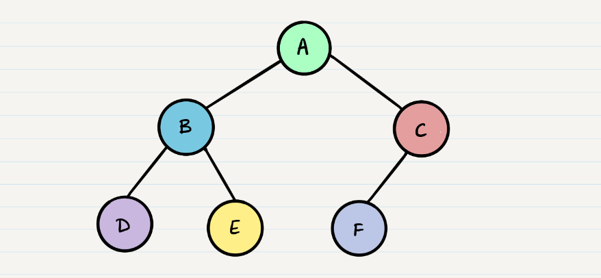

Why are tree data structures used?
Tree data structures are used to represent hierarchical relationships between objects or data elements. They are employed in various applications because they provide an efficient way to organize and access data, especially when the data has a hierarchical nature. The main reasons for using tree data structures are:

1. Hierarchical Organization: Trees naturally model hierarchical relationships, making them suitable for representing parent-child relationships or categories with subcategories.

2. Efficient Searching and Insertion: Trees allow for efficient searching and insertion operations. By utilizing a hierarchical structure, trees reduce the number of comparisons needed to find or insert a particular element compared to linear data structures like arrays or linked lists.

3. Fast Access and Retrieval: Trees enable quick access and retrieval of specific data elements. They support efficient operations like finding the minimum or maximum element, locating the successor or predecessor of an element, or performing range queries.

What are tree data structures?
Tree data structures consist of nodes connected in a hierarchical manner. Each node can have zero or more child nodes, except for the topmost node called the root. The nodes in a tree are organized in levels, with each level representing a different depth or generation. Here are some key components of a tree:

1. Node

2. Root

3. Parent and Child Nodes

4. Leaf Node

How are tree data structures implemented?
Tree data structures can be implemented in various ways, depending on the requirements and specific use cases. Two commonly used implementations are:

1. Linked Representation

2. Array Representation

Tree data structures can take different forms, such as binary trees, AVL trees, B-trees, or trie structures, each with their own unique characteristics and use cases. The choice of tree implementation depends on factors like the type of operations to be performed, memory constraints, and expected data size.

