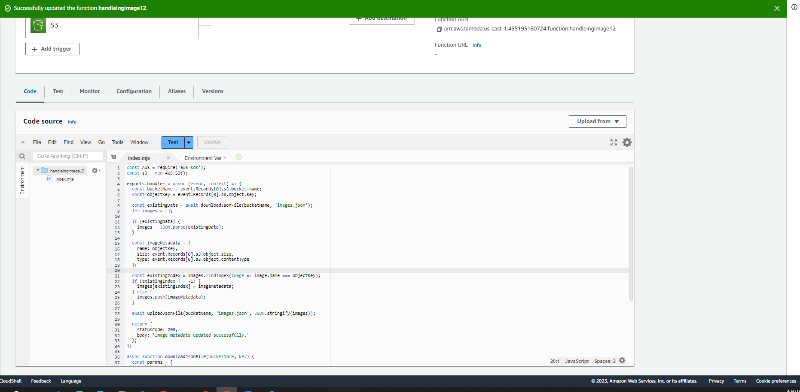

created the bucket 


https://www.sharooq.com/how-to-grant-public-read-access-to-an-s3-bucket-in-aws

edited the permissions 


added a bucket policy 


added cors


creating lambda function 


create a trigger 


create lambda function 



```javascript
const AWS = require('aws-sdk');
const s3 = new AWS.S3();

exports.handler = async (event, context) => {
  const bucketName = event.Records[0].s3.bucket.name;
  const objectKey = event.Records[0].s3.object.key;

  const existingData = await downloadJsonFile(bucketName, 'images.json');
  let images = [];

  if (existingData) {
    images = JSON.parse(existingData);
  }

  const imageMetadata = {
    name: objectKey,
    size: event.Records[0].s3.object.size,
    type: event.Records[0].s3.object.contentType
  };

  const existingIndex = images.findIndex(image => image.name === objectKey);
  if (existingIndex !== -1) {
    images[existingIndex] = imageMetadata;
  } else {
    images.push(imageMetadata);
  }

  await uploadJsonFile(bucketName, 'images.json', JSON.stringify(images));

  return {
    statusCode: 200,
    body: 'Image metadata updated successfully.'
  };
};

async function downloadJsonFile(bucketName, key) {
  const params = {
    Bucket: bucketName,
    Key: key
  };

  const data = await s3.getObject(params).promise();
  return data.Body.toString('utf-8');
}

async function uploadJsonFile(bucketName, key, data) {
  const params = {
    Bucket: bucketName,
    Key: key,
    Body: data
  };

  await s3.putObject(params).promise();
}
```

confirming the function works when uploading an image 

